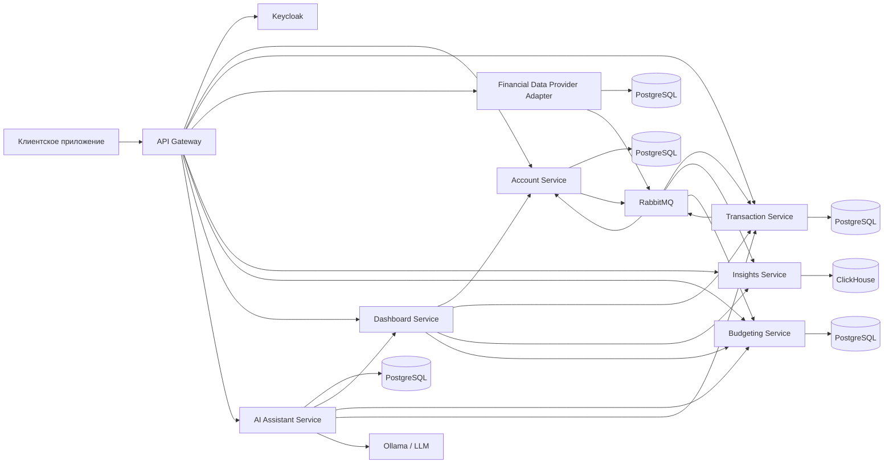
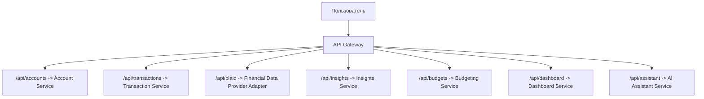
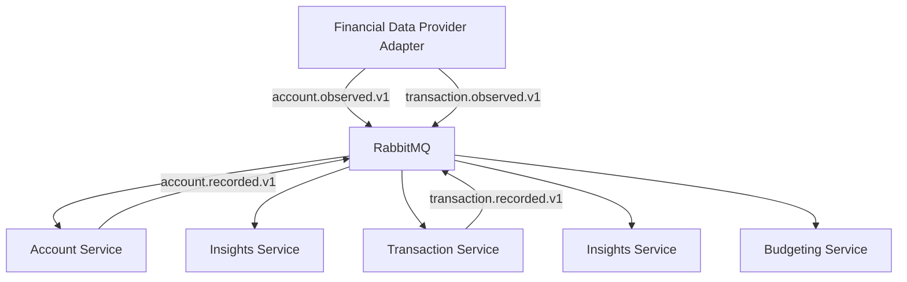
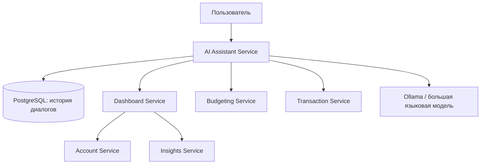

# Обоснование архитектурных решений

## Общая архитектура системы

Архитектура разрабатываемого приложения построена с учетом особенностей финтех-систем, для которых критичны безопасность пользовательских данных, надежность обработки финансовых операций, масштабируемость отдельных функциональных модулей и возможность последующего расширения. Так как приложение объединяет данные о банковских счетах, транзакциях, бюджетах и интеллектуальных рекомендациях, монолитный подход был бы менее удобным для сопровождения и развития. Поэтому в качестве основы выбрана микросервисная архитектура, где каждая функциональная область выделена в отдельный сервис.

Такой подход позволяет разделить ответственность между компонентами системы. Сервис интеграции с поставщиками финансовых данных отвечает за подключение внешних финансовых организаций и получение исходных банковских данных. На текущем этапе в качестве первого провайдера используется Plaid, однако архитектура предусматривает возможность добавления других поставщиков данных без изменения основной бизнес-логики приложения. Account Service хранит и предоставляет сведения о счетах пользователя. Transaction Service отвечает за обработку транзакций и категорий расходов. Insights Service используется для аналитических представлений и агрегированных финансовых показателей. Budgeting Service отвечает за пользовательские бюджеты и лимиты расходов. Dashboard Service объединяет данные из нескольких сервисов и формирует сводную информацию для пользовательского интерфейса. AI Assistant Service реализует взаимодействие с интеллектуальным финансовым ассистентом и использует данные других сервисов для подготовки персональных рекомендаций.

Рисунок 1. Общая архитектура системы

## Роль API Gateway

Центральной точкой входа в систему является API Gateway. Он принимает запросы от клиентского приложения и маршрутизирует их во внутренние сервисы по функциональным областям: счета, транзакции, подключения к банкам, аналитика, бюджеты, дашборд и ассистент. Использование API Gateway упрощает клиентскую часть приложения, так как ей не требуется знать адреса всех внутренних сервисов. Кроме того, такой подход позволяет централизованно применять общие правила безопасности, маршрутизации и наблюдаемости.

Рисунок 2. Маршрутизация запросов через API Gateway

## Безопасность и управление доступом

Для управления доступом выбран Keycloak. Данное решение вынесено в отдельный компонент, так как аутентификация и авторизация являются критически важными для финансового приложения. Пользователь проходит аутентификацию через Keycloak, после чего сервисы получают JWT-токен и проверяют его как ресурсные серверы OAuth 2.0. Это позволяет не хранить пароли пользователей внутри бизнес-сервисов и отделить управление учетными записями от логики обработки финансовых данных. Дополнительно каждый сервис использует идентификатор пользователя из токена, что обеспечивает изоляцию данных разных пользователей.

## Хранение данных

В системе применяется принцип «база данных на сервис». Для сервисов, работающих с транзакционными данными, используются отдельные экземпляры PostgreSQL. Такой выбор обусловлен необходимостью обеспечить целостность данных, поддержку транзакций и надежное хранение сущностей предметной области. Например, данные о подключениях к банкам, счетах, транзакциях, бюджетах и истории общения с ассистентом хранятся независимо друг от друга. Разделение хранилищ уменьшает связанность сервисов и позволяет изменять внутреннюю модель одного сервиса без прямого влияния на остальные компоненты.

Для аналитической части используется ClickHouse. Это решение выбрано потому, что аналитические запросы по истории транзакций отличаются от обычных CRUD-операций. Пользователю необходимо быстро получать сводки по доходам, расходам, категориям и периодам времени. Колоночная модель хранения ClickHouse хорошо подходит для таких задач, так как позволяет эффективно выполнять агрегирующие запросы по большим объемам финансовых данных. Таким образом, PostgreSQL используется для надежного хранения операционных данных, а ClickHouse - для аналитической обработки.

Разделение хранилищ реализовано следующим образом:

1. Сервис интеграции с поставщиками финансовых данных использует PostgreSQL для хранения подключений к финансовым организациям.
2. Account Service использует PostgreSQL для хранения счетов пользователя.
3. Transaction Service использует PostgreSQL для хранения транзакций и категорий расходов.
4. Budgeting Service использует PostgreSQL для хранения пользовательских бюджетов.
5. AI Assistant Service использует PostgreSQL для хранения истории диалогов с ассистентом.
6. Insights Service использует ClickHouse для хранения аналитических данных и агрегированных показателей.

## Асинхронное взаимодействие сервисов

Взаимодействие между сервисами реализовано не только через синхронные HTTP-запросы, но и через асинхронный обмен событиями с использованием RabbitMQ. Основное преимущество такого подхода заключается в снижении связанности компонентов: сервис-источник не вызывает напрямую все зависимые сервисы, а публикует событие о произошедшем изменении. После получения данных от внешнего финансового провайдера сервис интеграции публикует события о найденных счетах и транзакциях. Далее Account Service, Transaction Service, Insights Service и Budgeting Service могут обрабатывать эти события независимо, не блокируя работу друг друга. Такой подход упрощает расширение системы, так как новые сервисы могут подписываться на уже существующие события без изменения логики сервиса-источника.

Рисунок 3. Асинхронная обработка событий

## Архитектура интеллектуального ассистента

Отдельное архитектурное решение связано с выделением AI Assistant Service. Интеллектуальный ассистент не встроен напрямую в сервисы счетов или транзакций, а реализован как самостоятельный компонент. Это позволяет изолировать работу с языковой моделью, хранение истории диалогов и логику генерации ответов от основной финансовой логики. Сервис использует Spring AI и подключается к Ollama, что дает возможность использовать локальные большие языковые модели. Такой подход уменьшает зависимость от внешних облачных поставщиков и повышает контроль над обработкой пользовательских финансовых данных.

AI Assistant Service получает данные не напрямую из баз других сервисов, а через открытые внутренние API и специальные инструменты. Например, ассистент может запросить сводку через Dashboard Service, получить данные о бюджетах через Budgeting Service или использовать список категорий транзакций из Transaction Service. Это сохраняет границы ответственности сервисов: ассистент не знает внутреннюю структуру их баз данных, а работает только с подготовленными DTO и публичными контрактами. Благодаря этому изменение внутреннего хранения данных не требует переписывания логики ассистента, если внешний контракт остается стабильным.

Рисунок 4. Архитектура интеллектуального ассистента

## Агрегация данных для интерфейса

Dashboard Service выполняет роль агрегатора данных для пользовательского интерфейса. Он обращается к Account Service, Transaction Service, Insights Service и Budgeting Service, собирая информацию в удобный для клиента формат. Это решение позволяет не переносить сложную композицию данных в frontend-приложение. Пользовательский интерфейс получает готовые сводки, а серверная часть контролирует правила агрегации и может переиспользовать их как для отображения на дашборде, так и для работы ИИ-ассистента.

## Развертывание и наблюдаемость

Для развертывания и локальной разработки используется Docker Compose. Каждый сервис запускается в отдельном контейнере вместе со своими зависимостями: PostgreSQL, ClickHouse, RabbitMQ, Keycloak и инструментами наблюдаемости. Это обеспечивает воспроизводимость окружения и упрощает запуск системы на разных компьютерах. Контейнеризация также соответствует микросервисной архитектуре, так как каждый компонент может быть собран, запущен и масштабирован независимо.

Отдельное внимание уделено наблюдаемости системы. В сервисах настроены health-check endpoints, метрики, трассировка и централизованная отправка логов через OpenTelemetry в Grafana LGTM stack. Для распределенной системы это необходимо, так как пользовательский запрос может проходить через несколько сервисов. Наличие traceId и spanId в логах позволяет отслеживать путь запроса и быстрее находить источник ошибки. Это особенно важно для процессов синхронизации финансовых данных и генерации рекомендаций, где сбой может возникнуть как во внешней интеграции, так и во внутренней обработке событий.

## Итоговое обоснование

Таким образом, выбранная архитектура соответствует цели разработки агрегатора финансовых счетов с функцией интеллектуального финансового ассистента. Микросервисное разделение обеспечивает независимое развитие функциональных модулей, API Gateway упрощает взаимодействие с клиентом, Keycloak отвечает за безопасный доступ, PostgreSQL и ClickHouse разделяют операционные и аналитические нагрузки, RabbitMQ обеспечивает асинхронное взаимодействие и слабую связанность сервисов, а отдельный AI Assistant Service позволяет интегрировать интеллектуальные функции без нарушения основной бизнес-логики приложения.
